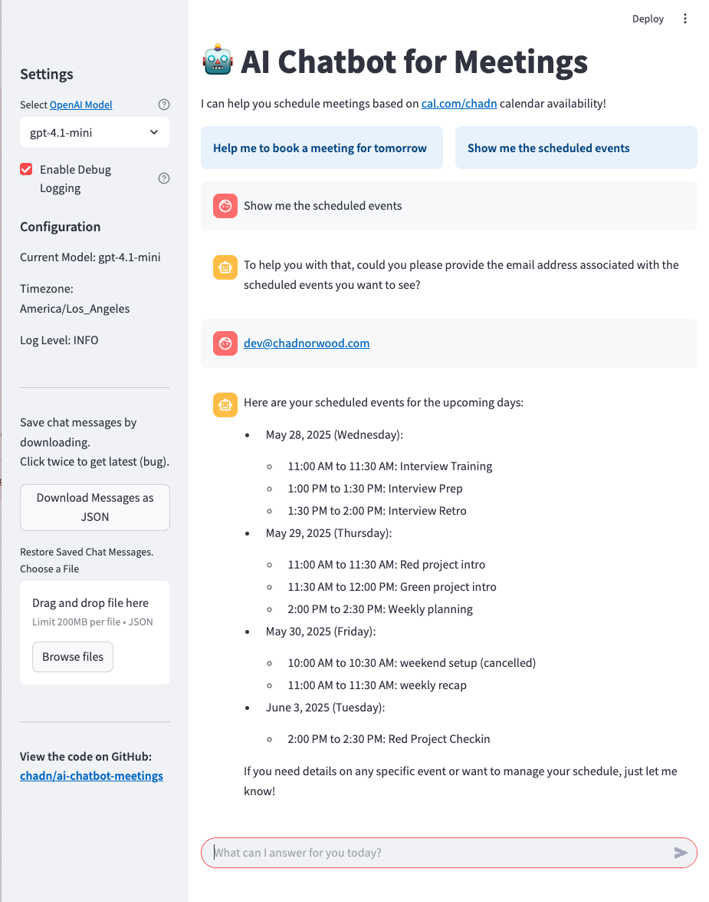

# 💬 AI Chatbot Meetings

A Streamlit-based chatbot application to book meetings on your cal.com calendar.
Uses the Langchain Framework to interact with OpenAI's language models, using tool calling to interact with cal.com's API.

Demo the code in this repo (requires openai key and cal.com key): https://ai-chatbot-meetings.streamlit.app/

## Features

-   Chat interface with OpenAI models (e.g. GPT-4.1)
-   [Cal.com](https://cal.com) integration for booking meetings and viewing scheduled events.
    Formerly Calendso, [Cal.com is the open-source](https://github.com/calcom/cal.com) Calendly successor.
-   Uses Langchain Framework which enables easy support for Tool Calling and OpenAI API.
-   Tool calling support for custom functions
-   Chat history management with JSON export/import
-   Debug print option with logging configuration
-   Streamlit-based web interface

Also see [Architecture.md](docs/Architecture.md) and [TODO.md](docs/TODO.md) for more detailed documentation.

## Streamlit Screenshot



## Cal.com Integration

This application integrates with Cal.com's API to provide the following calendar management features:

-   **Booking Meetings**: The chatbot can help users book meetings by collecting details like date, time, attendee information, and meeting reason.
-   **Checking Availability**: Users can ask about available time slots for specific dates.
-   **Viewing Scheduled Events**: Users can request to see their upcoming meetings and scheduled events.

To use these features, you'll need to:

1. Have a Cal.com account
2. Generate an API key from your Cal.com settings, https://app.cal.com/settings/developer/api-keys
3. Add the API key to your `.env` file as `CALCOM_API_KEY=your_key_here`

## Setup

1. Clone the repository
2. Create a virtual environment:
    ```bash
    uv venv
    source .venv/bin/activate  # On Windows: venv\Scripts\activate
    ```
3. Copy `.env.template` to `.env` and add your OpenAI API key and Cal.com API key:
    ```bash
    cp .env.template .env
    # Edit .env with your API keys
    ```
4. Install dependencies (and redo if you add/modify packages):
    ```bash
    uv pip install -e .
    ```

## Running the Application

```bash
streamlit run src/streamlit_app.py
```

You can add timestamps and log to a file when debugging like this:

```bash
streamlit run src/streamlit_app.py 2>&1 |ts |tee -a src/streamlit_app.py.log
```

## Development

The application is structured into several key components using a service-oriented architecture:

-   `ChatModelService`: Handles interactions with OpenAI's API and tool orchestration
-   `ChatHistoryManager`: Manages chat history and persistence with JSON export/import
-   `CalComService`: Provides Cal.com API integration for calendar operations
-   `ToolManager`: Handles tool calling functionality and LangChain integration
-   `AppConfig`: Centralized configuration management with environment variable support
-   Streamlit UI: Provides the user interface and interaction flow

For detailed information about design patterns, architectural decisions, and implementation details, see [Architecture.md](docs/Architecture.md).

Install development dependencies:

```
uv pip install -e .[dev]
```

Run the app with [httpdbg](https://github.com/cle-b/httpdbg) to capture HTTP requests and responses:

```bash
pyhttpdbg -m streamlit.web.cli run src/streamlit_app.py 2>&1 |ts |tee -a src/streamlit_app.py.log
```

Confirm code follows ruff linting guidelines

```bash
python -m ruff check src/
```

## Running Tests

Run all tests:

```bash
pytest tests/
```

For integration tests:

```bash
pytest tests/ -m integration
```

## Project Structure

```
/
├── .devcontainer/
│   └── devcontainer.json    # Configuration for development container
├── docs/
│   ├── Architecture.md       # System architecture and design patterns
│   └── TODO.md               # Project tasks and plans
├── src/
│   ├── streamlit_app.py      # Main Streamlit application
│   ├── config/
│   │   ├── __init__.py       # Configuration package exports
│   │   └── settings.py       # Application configuration management
│   ├── services/
│   │   ├── __init__.py       # Services package exports
│   │   ├── calcom_service.py # Cal.com API integration
│   │   ├── chat_history.py   # Chat history management
│   │   ├── chat_model.py     # OpenAI chat model integration
│   │   └── tool_manager.py   # Tool calling functionality
│   └── utils/
│       ├── __init__.py       # Utilities package exports
│       ├── logger.py         # Logging configuration
│       └── utils.py          # Utility functions
├── tests/
│   ├── __init__.py           # Test package initialization
│   ├── test_calcom_service.py # CalCom service unit tests
│   ├── test_chat_history.py  # Chat history unit tests
│   └── test_chat_model.py    # Chat model unit tests
│
├── .env                      # Environment variables configuration
├── .env.template             # Template for environment variables
├── .gitignore                # Git ignore file
├── .python-version           # Python version specification
├── pyproject.toml            # Project configuration and dependencies
├── uv.lock                   # UV package manager dependencies lock file (by uv lock)
├── LICENSE                   # License file (Apache 2.0)
└── README.md                 # Project documentation
```

## Environment Variables

For descriptions, see [.env.template](.env.template)

[Apache License 2.0](LICENSE)
